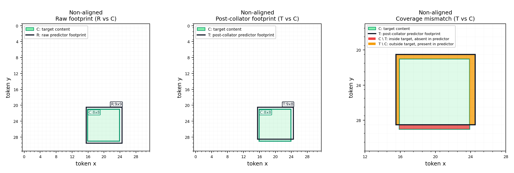

# I-JEPATH

Pathology-focused adaptation of I-JEPA for cross-resolution self-supervised learning on whole-slide images.

## Why this project
Standard SSL in pathology can overfit stain/scanner shortcuts. This project targets morphology-centric representations by predicting high-resolution target embeddings from lower-resolution tissue context (JEPA-style, no pixel reconstruction).

## Current scope
- Cross-resolution JEPA pretraining for pathology (`~1.0 mpp` context -> `~0.5 mpp` targets).
- Profile-aware anchor indexing from WSI + tissue masks.
- Online context/target extraction with target-footprint non-leakage masking.
- Smoke-trainable stage-1 pipeline and visualization QA.

## Planned after v1
- Add same-resolution JEPA batches (for example `20x -> 20x`) to improve nuclear-detail fidelity while keeping cross-resolution training.
- Add variable absolute scales while keeping fixed ratio (for example `5->10`, `10->20`, `20->40` when available).
- Add anti-confounder controls: stain/scanner augmentation, richer mask types, brightness/frequency normalization, and optional site-adversarial components.
- Evaluate reverse-ratio auxiliary training (`high-res context -> low-res target`) only after leakage/confound controls are stable.
- Run a controlled outside-context target ablation (`inside-only` vs `inside + near-outside ring`).
- Add optional I-JEPA-style variable target geometry (per-target size and aspect ratio), first as an ablation against fixed-square baseline.

## Docs
- `docs/scalable_pipeline_cutover.md`

## Sample curation pipeline


## Dataset structure
Use any dataset root; below is the expected structure and contracts:

```text
<DATA_ROOT>/
  manifests/
    slides_with_tissue_masks.csv
  indexes/
    slide_metadata.parquet
    anchor_catalog_manifest.json
    anchors/
      part-*.parquet
```

Manifest CSV format (`slides_with_tissue_masks.csv`):
- Header: `slide_id,wsi_path,mask_path`
- One row per slide.
- `wsi_path` and `mask_path` can point anywhere (absolute or relative paths). They do not need to be inside `<DATA_ROOT>`.

## Quick start
```bash
# Set your dataset root once
DATA_ROOT=/path/to/your-dataset

# 1) Verify runtime
python scripts/verify_training_runtime.py

# 2) Build slide metadata index
python scripts/build_slide_metadata_index_from_manifest.py \
  --manifest ${DATA_ROOT}/manifests/slides_with_tissue_masks.csv \
  --output ${DATA_ROOT}/indexes/slide_metadata.parquet \
  --report ${DATA_ROOT}/indexes/slide_metadata_build_report.csv

# 3) Build profile-specific anchor catalog
python scripts/build_valid_context_anchor_catalog.py \
  --slide-index ${DATA_ROOT}/indexes/slide_metadata.parquet \
  --profile configs/profiles/ctx1p0_tgt0p5_fov512um_k4.yaml \
  --output ${DATA_ROOT}/indexes/anchor_catalog_manifest.json

# 4) Smoke training (layered config: defaults + profile + run)
CUDA_VISIBLE_DEVICES=0 python main.py \
  --profile-config configs/profiles/ctx1p0_tgt0p5_fov512um_k4.yaml \
  --run-config configs/runs/tcga_prad_smoke.yaml \
  data.slide_manifest_csv=${DATA_ROOT}/manifests/slides_with_tissue_masks.csv \
  data.slide_metadata_parquet=${DATA_ROOT}/indexes/slide_metadata.parquet \
  data.anchor_catalog_manifest=${DATA_ROOT}/indexes/anchor_catalog_manifest.json

# OR one-command orchestration (build index + build anchors + train)
CUDA_VISIBLE_DEVICES=0 python main.py \
  --profile-config configs/profiles/ctx1p0_tgt0p5_fov512um_k4.yaml \
  --run-config configs/runs/tcga_prad_smoke.yaml \
  --manifest-csv ${DATA_ROOT}/manifests/slides_with_tissue_masks.csv \
  --output-folder ${DATA_ROOT}/outputs/full-pipeline

# 5) Single-machine multi-GPU launch (2 GPUs example)
CUDA_VISIBLE_DEVICES=0,1 python main.py \
  --profile-config configs/profiles/ctx1p0_tgt0p5_fov512um_k4.yaml \
  --run-config configs/runs/tcga_prad_smoke.yaml \
  data.slide_manifest_csv=${DATA_ROOT}/manifests/slides_with_tissue_masks.csv \
  data.slide_metadata_parquet=${DATA_ROOT}/indexes/slide_metadata.parquet \
  data.anchor_catalog_manifest=${DATA_ROOT}/indexes/anchor_catalog_manifest.json

# Rendezvous notes:
# - main.py auto-selects a free local MASTER_PORT for multi-GPU runs when MASTER_PORT is unset.
# - Set MASTER_PORT explicitly to override auto-selection.
# - For non-main.py multi-process launches (e.g. SLURM), set MASTER_PORT
#   or pass --master-port to main_distributed.py.

# defaults config is implicit: configs/defaults.yaml

# Merged resolved config is saved automatically to:
# outputs/<run-folder>/params-ijepa.yaml

# Image-budget semantics:
# - optimization.total_images_budget controls total training length
# - tuning/checkpoint events are triggered by images_seen thresholds
# - logging.step_log_every_images controls step-log cadence:
#   - 10000 => log every 10k images
#   - 0.1 => log every 10% of optimization.total_images_budget
#   - 0 disables cadence logging (NaN/Inf still logs immediately)
#   - percent strings like "10%" are not supported
```

## Diversity budget

Training is image-budget driven, and data diversity is reported as anchor passes:
- `anchor_count = manifest.total_anchors`
- `anchor_passes_total = total_images_budget / anchor_count`
- `coverage_first_pass = min(1, total_images_budget / anchor_count)`
- `mean_anchor_reuse = max(0, total_images_budget / anchor_count - 1)`

Heuristic interpretation:
- `< 1`: partial anchor coverage
- `1 - 5`: typical balance
- `> 5`: high anchor reuse (consider adding anchors or reducing total image budget)

Runtime logs emit these diagnostics at startup with warnings and suggested knobs:
- increase anchor diversity: enlarge anchor catalog
- increase within-anchor diversity: increase `data.targets_per_context`
- rebalance compute: adjust `optimization.total_images_budget`

## PathoROB tuning during pretraining (Camelyon, image-budget cadence)
```bash
DATA_ROOT=/path/to/your-dataset

CUDA_VISIBLE_DEVICES=0,1 python main.py \
  --profile-config configs/profiles/ctx1p0_tgt0p5_fov512um_k4.yaml \
  --run-config configs/runs/pathorob_camelyon.yaml \
  data.slide_manifest_csv=${DATA_ROOT}/manifests/slides_with_tissue_masks.csv \
  data.slide_metadata_parquet=${DATA_ROOT}/indexes/slide_metadata.parquet \
  data.anchor_catalog_manifest=${DATA_ROOT}/indexes/anchor_catalog_manifest.json \
  tuning.execution.device=auto \
  tuning.plugins[0].datasets.camelyon.manifest_csv=${DATA_ROOT}/pathorob/camelyon_manifest.csv
```

Async tuning behavior and key knobs:
- `tuning.execution.mode=async`: evaluator runs out-of-band; training step loop does not block on tuning execution.
- `tuning.execution.device=auto`: reserves one visible GPU for tuning automatically (`cuda:<id>` also supported).
- `tuning.execution.max_pending_jobs`: queue cap for pending eval snapshots.
- `tuning.execution.coalesce_policy=newest`: stale queued evals are dropped first under backlog.
- `tuning.execution.poll_every_steps`: poll cadence in optimizer steps. `auto` (default) resolves to `round(tune_every / (global_batch_size * 20))`.
- `tuning.execution.keep_last_n_snapshots`: limits on-disk teacher snapshot retention.
- `tuning.plugins[*].feature_num_workers`, `feature_persistent_workers`, `feature_prefetch_factor`: feature extraction loader throughput controls.
- `tuning.plugins[*].ri/apd/clustering.every_n_evals`: cadence controls for heavy metrics (counted in tune runs).
- Tune metadata logs use `tune/tune_index` and `tune/tune_images_seen`.
- `training.log_every`: cadence for `train/*` W&B logs in images seen (plus a final flush at run end).
- `tuning.tune_every`: cadence for tuning events in images seen.
- `data.anchor_stream_batch_size`: parquet decode chunk size for anchor streaming (`2048` default). Increasing to `4096`/`8192` can reduce periodic rollover stalls at higher memory cost.
- `logging.performance_debug.*`: optional rolling step timing diagnostics for spotting data-wait spikes and intermittent loader stalls.
- Tune metrics log with `images_seen` as their W&B step metric so tuning curves can be plotted directly on image budget.

Checkpoint semantics:
- Always keeps `<write_tag>-latest.pth.tar`
- Also writes image-tagged snapshots at thresholds (`training.save_every`, overridden by `tuning.tune_every` when tuning is enabled):
  - `<write_tag>-img1000000.pth.tar`
  - `<write_tag>-img2000000.pth.tar`
- If robustness early stopping is enabled and improves, writes `best-robustness.pth.tar`

Performance-debug example (for periodic tqdm hiccups):
```bash
python main.py --profile-config ... --run-config ... \
  logging.performance_debug.enable=true \
  logging.performance_debug.log_every_images=2048 \
  data.anchor_stream_batch_size=4096
```

## Preview generation
```bash
python scripts/preview_context_targets.py \
  --anchor-catalog ${DATA_ROOT}/indexes/anchor_catalog_manifest.json \
  --output-dir outputs/previews \
  --num-samples 8
```

Outputs per sample:
- `preview_sXXX_<slide_id>_<anchor>.png`: static final flow layout (all steps visible).
- `ijepa_sXXX_<slide_id>_<anchor>.gif`: animated progressive reveal of the same layout.
- `ijepa_sXXX_<slide_id>_<anchor>_all_steps.png`: high-resolution final frame (`--final-png-scale` controls scale, default `2.0`).
- `zoom4_sXXX_<slide_id>_<anchor>.png`: zoomed 2x2 static view of steps 2-5 for a few anchors (`--num-zoomed-previews`, default `2`).

## Tests
```bash
pytest tests
pytest -m integration tests/test_pipeline_integration.py
```

## Benchmarking
```bash
python scripts/benchmark_data_pipeline.py --mode index \
  --manifest ${DATA_ROOT}/manifests/slides_with_tissue_masks.csv \
  --slide-metadata ${DATA_ROOT}/indexes/slide_metadata.parquet \
  --anchor-manifest ${DATA_ROOT}/indexes/anchor_catalog_manifest.json
```

## Notes
- Metadata distinguishes `source_*_mpp` (pyramid read spacing) vs `effective_*_mpp` (nominal requested spacing semantics).
- Tissue-aware target fallback policies are configurable (`skip_anchor`, `skip_slide`, `lower_threshold`).
- Target box patch-alignment is configurable via `data.align_targets_to_patch_grid`.

### Target Sampling Strategy: Aligned vs Non-Aligned
Use `data.align_targets_to_patch_grid` to choose how target boxes are sampled in context coordinates.

- Notation used below:
  - `C`: continuous target content extent in context coordinates.
  - `R`: raw tokenized footprint before collator truncation.
  - `T`: post-collator predictor footprint (`T ⊆ R`).

- Non-aligned (`false`, default):
  - Preserves sub-patch offsets and increases spatial diversity.
  - Floor/ceil rasterization can make `R` larger than `C`.
  - After `min_keep_pred` truncation, `T` can drop part of `R`.
  - Net effect can include both `C \ T` (target content not represented in predictor footprint) and `T \ C` (predictor footprint outside target content).
  - Leakage clarification: context masking is built from pre-truncation `R` (typically `R ⊇ C`), not from `T`, so this is conservative over-masking (context sees less), not target exposure.
  - Practical consequence: the core issue is supervision mismatch, not leakage; predictor summarizes tokens indexed by `T`, while teacher supervision comes from the full target crop embedding.



- Patch-aligned (`true`):
  - Snaps boxes to patch boundaries, producing cleaner and more interpretable footprint geometry.
  - For the standard fixed-size setup here (target size is patch-multiple), alignment makes `C`, `R`, and `T` coincide and removes `C/T` mismatch.
  - Trades off some spatial diversity (fewer sub-patch offsets).


- Practical guidance:
  - Prefer `false` for representation diversity.
  - Prefer `true` for debugging, controlled ablations, and maximum predictor-teacher geometric alignment.

## Upstream provenance
Based on the official I-JEPA implementation and paper:
- Assran et al., *Self-Supervised Learning from Images with a Joint-Embedding Predictive Architecture*, arXiv:2301.08243.
